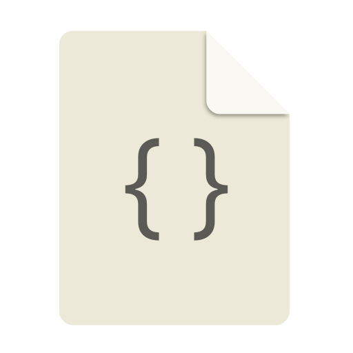
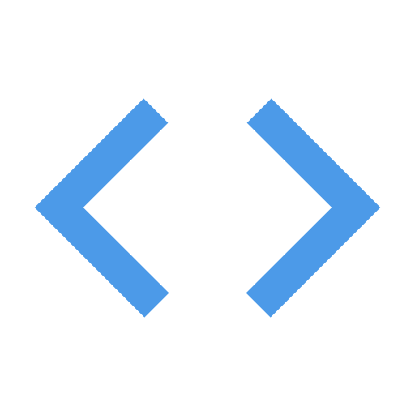

<h1 align="left" id="macropower-title">:wave: Hello there! I am Gabriel Barreto</h1>
<h5 align="left">
IT professional with a background in Infrastructure and Front-end development.
I enjoy building scalable, reliable systems by combining code and infrastructure.
Currently focused on SRE / DevOps practices and Infrastructure as Code. 🚀 #AliveIaC
</h5>
<div> 
  <a href = "mailto:gabriel02_barreto@hotmail.com" target="blank"></a>
  <a href="https://www.linkedin.com/in/gabrielbarretods/" target="blank"></a> 
</div>

<br>

 <div>
  <a href="https://github.com/gadsilva">
  
  
</div>

<br>
<h2 align="left" id="macropower-tech">Favorite Tech</h2>

> Tools, languages, and other things that I like to work with.

<table>
  <tr>
  <!-– ##first column -- >
  <!-– #programming language and CI/CD -- >
    <td align="center" width="96">
      <a href="#gadsilva">
        
      </a>
      <br> Python <h5> █████░░ </h5>
    </td> 
    <td align="center" width="96">
      <a href="#gadsilva">
        
      </a>
      <br> Terraform/hcl <h5> █████░░ </h5>
    </td>
    <td align="center" width="96">
      <a href="#gadsilva">
        
      </a>
      <br> CSS <h5>  ██████░ </h5>
    </td>
    <td align="center" width="96">
      <a href="#gadsilva">
        
      </a>
      <br>JS <h5> ██░░░░░ </h5>
    </td>
    <td align="center" width="96">
      <a href="#gadsilva">
        
      </a>
      <br>Powershell  <h5> █████░░ </h5>
    </td>    
    <!-– #CI/CD / Versionamento -- >
    <td align="center" width="96">
      <a href="#gadsilva">
        
      </a>
      <br> AzDevOPs <h5> ████░░░ </h5>
    </td> 
    <td align="center" width="96">
      <a href="#gadsilva" >
        
      </a>
      <br>  Git Lab <h5> ███░░░░ </h5>
    </td>
    <td align="center" width="96">
      <a href="#gadsilva">
        
      </a>
      <br>Git Hub <h5> █████░░ </h5>
    </td>    
  </tr>
  <tr>
    <!-– ##Second column -- >
    <!-– # containers-- >
     <td align="center" width="96">
      <a href="#gadsilva">
        
      </a>
      <br>Docker <h5> █████░░ </h5>
    </td>
   <td align="center" width="96">
      <a href="#gadsilva">
        
      </a>
      <br>Kubernetes  <h5> ███░░░░ </h5>
    </td>
    <!-– #OS -- > 
    <td align="center" width="96">
      <a href="#gadsilva" >
        
      </a>
      <br>Windows <h5> ████░░░ </h5>
    </td>
    <td align="center" width="96">
      <a href="#gadsilva" >
        
      </a>
      <br>Linux <h5> █████░░ </h5>
    </td>
    <!-– #Cloud -- > 
    <td align="center" width="96">
      <a href="##gadsilva">
        
      </a>
      <br>GCP <h5> ████░░░ </h5>
    </td> 
   <td align="center" width="96">
      <a href="#gadsilva">
        
      </a>
      <br>Azure <h5> ████░░░ </h5>
    </td>    
   <td align="center" width="96">
      <a href="#gadsilva">
        
      </a>
      <br>AWS <h5> ██░░░░░ </h5>
    </td> 
    <!-– #source-code editor -- > 
     <td align="center" width="96">
      <a href="#gadsilva">
        
      </a>
      <br>VSCode <h5> █████░░ </h5>
    </td>              
  </tr>
  <tr>
  <!-– #third line -- >
  <!-– #Monitoring -- >
    <td align="center"  width="96">
      <a href="#gadsilva">
        
      </a>
      <br>Newrelic <h5> ███░░░░ </h5>
    </td>
    <td align="center"  width="96">
      <a href="#gadsilva">
        
      </a>
      <br>Pagerduty <h5> ███░░░░ </h5>
    </td>
    <td align="center" width="96">
      <a href="#gadsilva" >
        
      </a>
      <br>Grafana <h5> ███░░░░ </h5>
    </td>
    <td align="center" width="96">
      <a href="#gadsilva" >
        
      </a>
      <br>ClouFlare <h5> ███░░░░ </h5>
    </td>
    <td align="center" width="96">
      <a href="#gadsilva" >
        
      </a>
      <br>Dyndns <h5> ██████░ </h5>
    <td align="center" width="96">
      <a href="##gadsilva">
        
      </a>
      <br>CI/CD <h5> ███████ </h5>
    <td align="center" width="96">
      <a href="##gadsilva">
        
      </a>
      <br>IAC <h5> ███████ </h5>
    </td>       
    </td>
     <td align="center" width="96">
      <a href="#gadsilva">
        
      </a>
      <br> Agile <h5> ███████ </h5>
    </td>           
  </tr>  
</table>
 
<br>

📊 **Currently I've been spending more of my time using:**
<!--START_SECTION:waka-->

```text
GCP           ███████████████████████▓░   39.40 %
Terraform     ████████████████████░░░░░   30.60 %
Az DevOps     █████████████████░░░░░░░░   15.00 %
GitHub        █████████████████░░░░░░░░   15.00 %
```
<!--END_SECTION:waka-->

- :office: &nbsp;I'm currently working at **[Stone]**
- :seedling: &nbsp;I’m currently learning **Ansible and Go**
- :speech_balloon: &nbsp;I like to talk about **Terraform** and **Pyhon**
- :mailbox: &nbsp;Ask me anything on my **[issues page]**


<h2 align="left">Coding Activity</h2>

> Total logged time since 2018. Updated every 1 hour. 

<!-- prettier-ignore-start -->
<!-- START_SECTION:ascii_graph -->

```

             ┼─────────────┬─────────────┬─────────────┬─────────────┬─────────────┬─────────────┬─────────────┤ 
            -7d           -6d           -5d           -4d           -3d           -2d           -1d           now
```

<!-- END_SECTION:ascii_graph -->
<!-- prettier-ignore-end -->

<!-- links -->

[Stone]: https://github.com/stone-payments "Stone"
[issues page]: https://github.com/gadsilva/issues "gadilva/issues"
